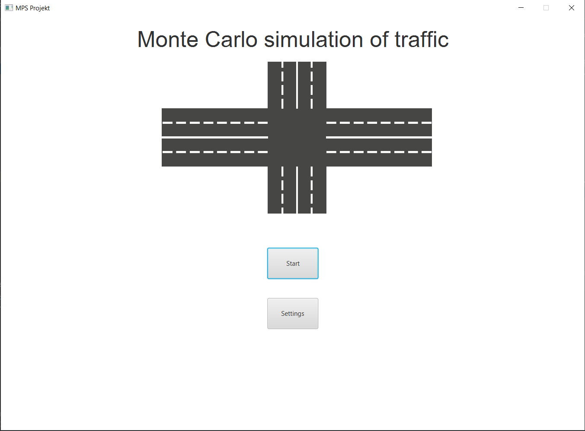
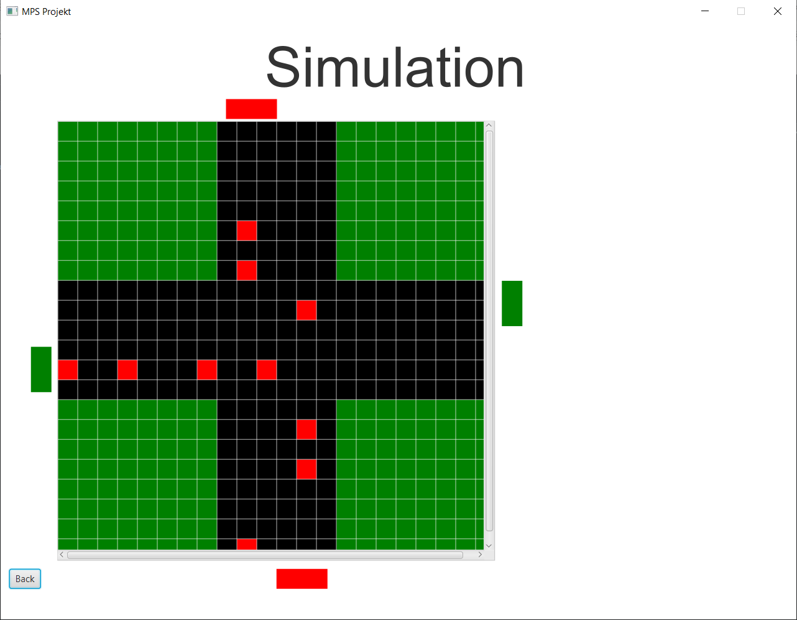
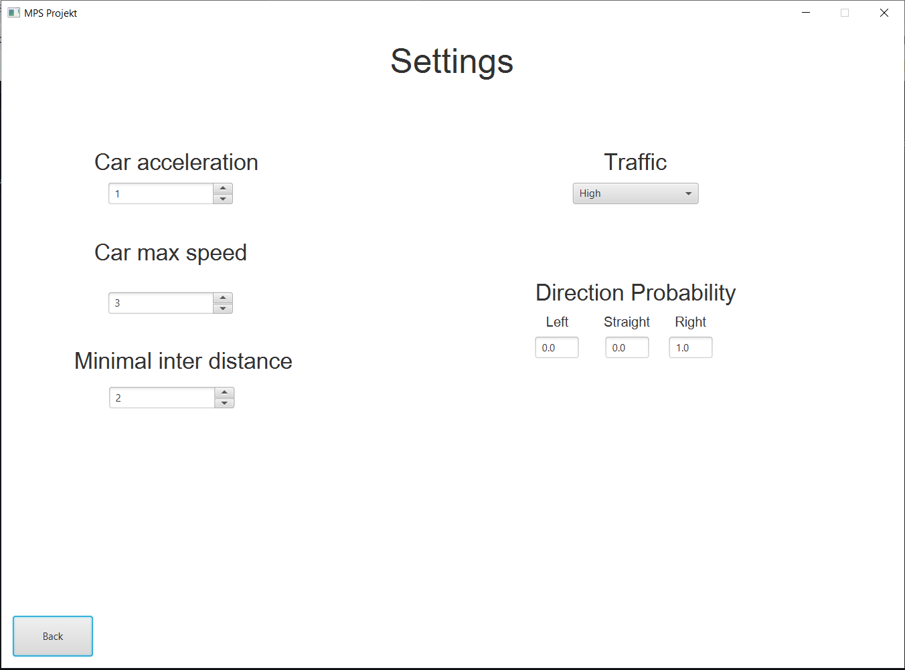

# Traffic Simulation - Modeling Physical Systems

Traffic Simulation is a project made for Modeling Physical Systems at AGH-University of Science and Technology

## Project description

The application simulates the traffic junction with the given traffic parameters.

- `controller` package - JavaFX controller classes (`BaseController`, `MainMenu`, `Options`, `Simulation`)
- `logic`
  - `cars` - car specific classes: `enum Direction`, `enum Type`, `class Vehicle` containing all vehicle's possible actions
  - `Lights` - classes handling the light change and containing its parameters
  - `Grid` - class which abstracts from array indices to memory-saving grid representation
  - `Junction` - class managing `Vehicle`, `TrafficLight`, `Grid` and `Settings` cooperation and implementing junction-like logic
  - `Settings` - contains all simulation parameters
- `view`
  - `Cell` - a single grid cell ~ an agent
  - `JunctionGrid` - class managing simulation visualisation
- `Main` - main class responsible for starting the application or performing no GUI tests

The `gridVisualizations` directory ontains no GUI visualization of the state of the junction at the given time:

```
11
---
WEST:YELLOW
NORTH:RED_YELLOW
EAST:YELLOW
SOUTH:RED_YELLOW
---
xxxxxxxx-1----xxxxxxxx
xxxxxxxx-1----xxxxxxxx
xxxxxxxx------xxxxxxxx
xxxxxxxx-1----xxxxxxxx
xxxxxxxx------xxxxxxxx
xxxxxxxx-1----xxxxxxxx
xxxxxxxx------xxxxxxxx
xxxxxxxx-1----xxxxxxxx
----------------------
---------1-1---1------
----------------------
----------------------
-----1--1--1----------
----------------------
xxxxxxxx------xxxxxxxx
xxxxxxxx----1-xxxxxxxx
xxxxxxxx------xxxxxxxx
xxxxxxxx----1-xxxxxxxx
xxxxxxxx------xxxxxxxx
xxxxxxxx----1-xxxxxxxx
xxxxxxxx------xxxxxxxx
xxxxxxxx----1-xxxxxxxx

```

## Results

### Main menu:


### Simulation view:


### Settings:



## Sources

Sources are available in Materials directory